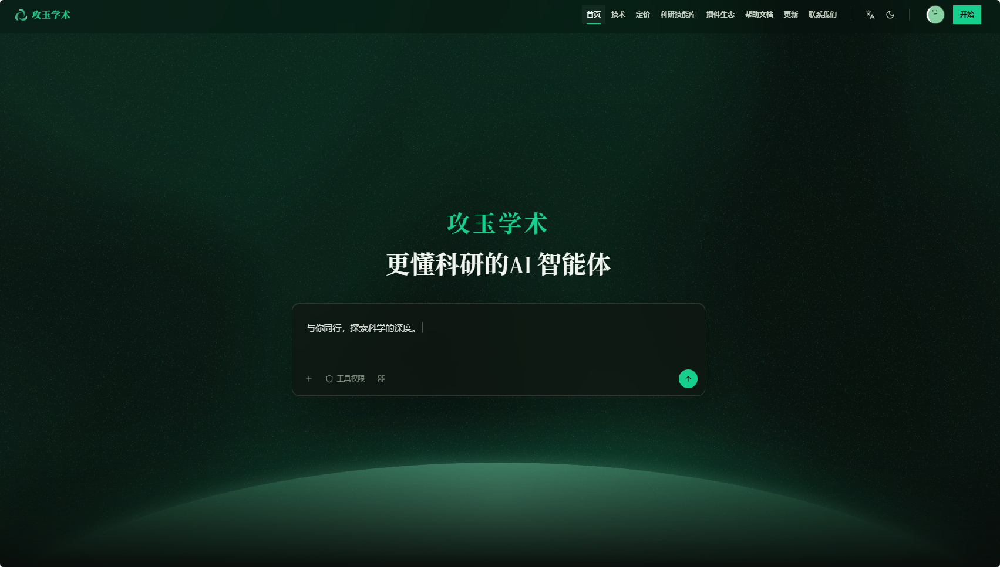

  

<h1 align="center">Jadense in Zotero</h1>

Jadense · AI reading assistant for Zotero

  
  
  
  

[简体中文](README.md) · **English**

**Understand papers in Zotero, and turn what you read into the next step of your research.**

[Paper Q&A](docs/usage-guide.md#paper-chat) · [Source-linked annotations](docs/usage-guide.md#paper-analysis) · [Selection translation](docs/usage-guide.md#selection-translation) · [Full translation and local OCR](docs/usage-guide.md#full-translation) · [Figure interpretation](docs/usage-guide.md#figures) · [Reference verification and import](docs/usage-guide.md#references)

Jadense in Zotero is a source-available AI reading assistant from [Jadense (攻玉学术)](https://jadense.cn/). Ask questions about the paper you are reading, keep analysis notes alongside the original passages, and follow up on difficult paragraphs or figures—all within Zotero.

**Free for personal non-commercial use · Commercial use prohibited · Bring your own API key (BYOK) · Jadense account optional**

**[Download the plugin](https://github.com/jadense-ai/jadense-in-zotero/releases/latest)** · [Requirements and installation methods](#requirements) · [Quick start](#quick-start) · [Explore Jadense](#continue-research)

The client is source-available under the [non-commercial license](LICENSE). Model usage is billed according to your chosen provider or your Jadense account's subscription and points rules.

<!-- release-summary:start -->
> **[v0.4.5](https://github.com/jadense-ai/jadense-in-zotero/releases/tag/v0.4.5)**: Latest plugin code with the literature workspace, local OCR, translation, analysis, and reader assistance. [Release details and artifacts](https://github.com/jadense-ai/jadense-in-zotero/releases/tag/v0.4.5) · [Changelog](CHANGELOG.md)
<!-- release-summary:end -->

## Start here: requirements, installation methods, and feature links

### Plugin requirements

- **Host application**: [Zotero Desktop 8.0–10.0.*](https://www.zotero.org/download/). Automatic figure detection additionally requires a compatible PDF reader in Zotero 10.0.1 or later.
- **AI access**: to use AI features, configure one AI service. Use [BYOK](docs/usage-guide.md#byok-provider) with a provider API key, base URL, and model ID—no Jadense account required—or [connect Jadense](docs/usage-guide.md#connect) with a Jadense account and plugin token. Model usage follows the billing and access rules of the selected provider or Jadense account.
- **Local OCR**: chat and selection translation do not require Python; [full translation and full Markdown extraction](docs/local-ocr.md) require a local OCR runtime, Python dependencies, and models. The first setup needs network access and several GB of disk space.
- **Optional Zotero Connector**: Zotero Connector is not a dependency of this plugin. It only collects papers from the browser; whether it is installed does not affect reading local papers and PDFs in Zotero.

### Current installation methods

| Method | How | Notes |
| --- | --- | --- |
| [Official plugin page](https://jadense.cn/plugin/zotero) | Get the `.xpi` from the page's download entry, then follow [Zotero's plugin installation instructions](https://www.zotero.org/support/plugins) | Use the version, compatibility range, and availability shown on the official page |
| [GitHub Release](https://github.com/jadense-ai/jadense-in-zotero/releases/latest) | Download `jadense-in-zotero-v0.4.5.xpi`, then open it from Zotero **Tools → Plugins → gear → Install Plugin From File…** | The current public release is [v0.4.5](https://github.com/jadense-ai/jadense-in-zotero/releases/tag/v0.4.5), with metadata and SHA-256 checksums |
| Zotero automatic update | In Zotero, open **Tools → Plugins → gear → Check for Updates** | Uses the [official Jadense update manifest](https://jadense.cn/plugins/zotero/jadense-in-zotero/updates.json); this channel is maintained separately from GitHub Releases, so use a manual method if the new version is not listed |
| Build from source | Follow the [contributor guide](CONTRIBUTING.md#开发与本机验证) with Node 24 and pnpm 10.19.0, then install `release/zotero/v0.4.5/jadense-in-zotero-v0.4.5.xpi` | For development and auditing; the private main app, database, and `.env` are not required |

All methods ultimately install the Zotero `.xpi` plugin. Do not treat GitHub's **Source code** archive as an install package, and do not enable the legacy `.com` plugin identity alongside the current one. See [upgrade instructions](#upgrade) for migration details.

## Contents

- [Start here: requirements, installation methods, and feature links](#requirements)
- [How to use this plugin](#quick-start)
  - [1. Install and open the workbench](#install)
  - [2. Choose an AI connection](#ai-connection)
    - [2.1 Bring your own key](#use-byok)
    - [2.2 Connect Jadense](#connect-jadense)
  - [3. Your first reading session](#first-reading)
  - [4. Language and theme](#display-language-and-theme)
- [Reading features](#read-and-analyze-papers)
- [Zotero introduction (中文)](docs/zotero-guide.md) · [Illustrated guide (中文)](docs/usage-guide.md)
- [FAQ](#faq) · [Upgrade](#upgrade) · [Changelog](CHANGELOG.md)
- [Continue your research](#continue-research)
  - [Meet Jadense](#jadense-introduction) · [Bring papers into a project](#research-project)
- [Support us](#support) · [WeChat / Alipay support page](support/README.md)
- [Contribute and share feedback](#contribute-and-share-feedback) · [Release workflow (中文)](CONTRIBUTING.md#发布正式版本)
- [License](#license)

## How to use this plugin

**Install → configure one AI connection → select a model → open a PDF.** Chat and selection translation do not require Python. Full translation installs local OCR automatically; the first setup downloads dependencies and models and needs several GB of disk space. See [OCR setup and troubleshooting (Chinese)](docs/local-ocr.md). BYOK requires access to your configured model API.

The [illustrated guide (Chinese)](docs/usage-guide.md) walks through provider, model, token and reader settings.

The workbench supports both English and Simplified Chinese. The steps below also include Chinese labels for reference; choose your display language in **Settings → General (设置 → 常规)**.

### 1. Install and open the workbench

1. Download the `.xpi` plugin file from the [latest release](https://github.com/jadense-ai/jadense-in-zotero/releases/latest). This release is **0.4.5**. If you have an older version installed, read the [upgrade instructions](#upgrade) first.
2. In Zotero's plugin manager, choose the option to install a plugin from a file and select the XPI.
3. Open the workbench from Zotero's Jadense entry and choose how to connect to a model service.

Both options use the same installation package and support paper Q&A, translation, analysis, and figure interpretation. Image support depends on the selected model.

| Connection | A good fit if you… | What you need |
| --- | --- | --- |
| Bring your own key (BYOK) | Already use a model service and want to choose your provider and models | The provider's API key, base URL, and model ID; no Jadense account required |
| Connect Jadense | Want to use your Jadense account's model services and bring papers into further research | A Jadense account and plugin token |

Jadense AI requests require the temporary-execution V1 server protocol; older servers show an upgrade message. Recover result retrieves existing pending results, and opening history never resends a request automatically. BYOK works independently and does not automatically retry uncertain third-party requests. Batched reference AI is off by default and can be enabled in feature settings.

### 2. Choose an AI connection

#### 2.1 Bring your own key (BYOK)

1. Open the workbench's gear menu, **Settings → BYOK (设置 → BYOK)**. Add a provider, choose the OpenAI Chat Completions, OpenAI Responses, or Anthropic Messages protocol, and enter your base URL and API key.
2. Add a model, enter its model ID, and set its output limit as required by the provider. You can use the connection test to check the configuration.
3. In **Settings → Feature settings (设置 → 功能配置)**, select your BYOK model for AI chat. **Automatically follow the current Chat model** is enabled by default, so other features use that model. Turn it off to choose independent translation, analysis and figure models.

Chinese UI shown from the current build's browser preview with fictional configuration. Replace the example URL and key; do not copy them. [Add a model and select feature models (中文)](docs/usage-guide.md#byok-model).

The plugin sends BYOK model requests directly to your configured provider. **Literature analysis → Analysis settings (文献解析 → 解析配置)** edits the same analysis model setting as Feature settings. Changing or deleting a model does not automatically redirect failed requests to another provider.

#### 2.2 Connect Jadense

1. In [Jadense](https://jadense.cn/), create a token under **Settings → Integrations → Connect Jadense in Zotero (设置 → 集成 → 连接 Jadense in Zotero)**.
2. In the plugin, open **Settings → Connect Jadense (设置 → 连接攻玉)**, paste the plugin token, and save.
3. In **Settings → Feature settings (设置 → 功能配置)**, choose models available to your account. **Jadense → Your account (攻玉学术 → 用户信息)** contains **Your Jadense (你的攻玉)**, with your account, subscription, available points and their source, check-in rewards, and streak.

The top of **Your account** provides links to the Jadense homepage, check-in page, and subscription usage, even before you connect an account. Complete check-in on the website, then refresh **Your Jadense** to view the updated status. Account and points information load separately, so one failed refresh does not hide the other.

### 3. Your first reading session

Open a PDF with selectable text, select a paragraph you find difficult, and use the translation shortcut. Then click **Ask (提问)** in the PDF toolbar and enter:

> Explain this paper's central research question, and point out the methods and experimental results I should examine most closely.

When you are ready for a closer read, click **Analyze (解析)** to view the summary, notes, and annotations. For more instructions, open **Getting started (上手指南)** in the workbench.

For full translation, analysis, reference import and figures, follow the [step-by-step reading guide (Chinese)](docs/usage-guide.md#reading).

### 4. Display language and theme

Open **Settings → General (设置 → 常规)** to choose your display language and theme. The native Zotero plugin settings share the same preferences.

- **Display language**: follow Zotero, Simplified Chinese, or English; the default follows Zotero. Chinese Zotero locales use Simplified Chinese, and other locales use English. Restart Zotero after saving; reopening the workbench alone does not switch languages. This does not change translation direction, AI output requirements, papers, or existing history.
- **Theme**: follow Zotero, light, or dark; the default follows Zotero and updates open plugin interfaces immediately. Existing light/dark choices are preserved. The sidebar button also saves your theme choice, while drafts and active generation continue.
- **Font size and translation panels**: choose a 12–24px plugin font, a standard or frosted-glass panel, and background transparency. Drag the selection-translation panel by its title or resize its edges and corners; the bottom-left Appearance menu offers the same style controls. Full translation uses an opaque, resizable sidebar with independent text settings. Transparency affects only the selection panel background. Frosted glass requires host graphics support and falls back to a standard background when unavailable.

The workbench, reader tools, guide, native settings, menus, and notices support both languages. Zotero continues to control window frames, system title bars, and PDF page appearance.

## Read and analyze papers

### [Keep the key points next to the original text](docs/usage-guide.md#paper-analysis)

Click **Analyze (解析)** in the PDF toolbar to get a summary and detailed notes, with native Zotero annotations that let you check the corresponding passages. Generated annotations can be edited, filtered, and exported with the PDF. They do not overwrite your manual annotations; findings that cannot be located in the original text remain available in the analysis notes.

### [Follow your questions into the methods and evidence](docs/usage-guide.md#paper-chat)

Click **Ask (提问)** to start a conversation about the current paper. You can also attach Zotero items, PDFs, or selected text and ask, “Why did the authors choose this method?” or “What assumptions does this conclusion depend on?” Conversation history is saved locally so you can return to it and keep asking questions.

### [Translate difficult passages as you read](docs/usage-guide.md#selection-translation)

Select text and click **AI translation (智能翻译)** in the selection popup, or press `Ctrl+Alt+T` (`⌘+Alt+T` on macOS), to view a translation in a floating reader panel. Choose from 32 language options for the current selection; existing per-paper language preferences remain effective. The top toolbar's **Full translation (全文翻译)** handles the whole PDF; use the selection popup or shortcut for selected text.

### [Translate a whole PDF and check the original passages](docs/usage-guide.md#full-translation)

Choose **Full translation** from the reading actions to read paragraph translations and navigate to their source. Translations now form a continuous document in the reader sidebar, with a table of contents, independent typography, and restored reading position. Reading mode keeps browsing separate from source navigation; Locate mode links paragraphs to the PDF. Hiding the sidebar keeps the task running; after interruption or restart, manually resume from translation history without losing completed parts. Choose AI or Bing/Google in Settings → Feature settings → Translation. Full translation first uses local OCR, including scanned pages, then sends recognized text to the selected translation service. It does not export a bilingual PDF with the original layout.

### [Follow the evidence through references](docs/usage-guide.md#references)

**Analyze** also extracts the current PDF's references. Under **Literature analysis → Paper details → References (文献解析 → 论文详情 → 参考文献)**, inspect the source, verify DOIs, and select verified entries to import into Zotero. Original order, numbering, duplicates, and unconfirmed text are retained. Import deduplicates by DOI within the same library and saves metadata and links without downloading PDFs.

When reader space is limited, Ask, Analyze, Quote, and Full translation appear under the **•••** reading actions menu. Click the Jadense icon to open the workbench directly.

### [Interpret figures with the paper's context](docs/usage-guide.md#figures)

Click an automatically detected image, or press `Ctrl+Alt+S` (`⌘+Alt+S` on macOS) to select a PDF region, then start a new conversation or add it to the current one. A new figure conversation includes the current paper and extractable PDF text, helping you ask questions such as “What conclusion does this comparison support?” You can also upload, paste, or drag PNG/JPEG images into a conversation. Images are saved locally with the conversation so you can view them and follow up after reopening it.

Figure interpretation requires a model that accepts images. Automatic detection requires a compatible PDF reader in Zotero 10.0.1 or later. When an image is not detected, you can select a region manually in a PDF reader that supports native cropping. Both capture and translation shortcuts can be customized in Settings.

## From reading papers to pursuing a research question

### Meet Jadense

The public Jadense homepage, captured in dark theme. Click the image to visit the website.

After a few papers, your question may shift from “What does this paper say?” to “How do these methods differ, and what evidence is still missing for my project?”

**Jadense (攻玉学术)** supports that next step: organize relevant papers in a research project and keep working on the same question. Use what you have read to compare methods, organize evidence, and plan what to investigate next.

### Bring papers into a research project

1. Select the relevant papers in Zotero and open **Jadense → Literature sync (攻玉学术 → 文献同步)** in the plugin.
2. Choose a Jadense favorites folder, decide whether to include PDFs, and upload the selected papers.
3. On the Jadense website, open or create a project, click **Add context (添加上下文)**, select these papers from your personal favorites, and start a conversation in the project.

For example, give the project a specific task:

> Based on the supplied papers, compare the study subjects, methods, and main evidence. Distinguish the authors' conclusions from inferences, list questions that need further literature searches, and draft an outline for a literature review. Clearly identify gaps in the available material.

Uploading is a **one-way operation from Zotero to Jadense**. You choose whether to include PDFs, and metadata and PDF upload results are reported separately. Plugin conversations, notes, and annotations are not automatically synced to the website with the papers. If you only need reading assistance inside Zotero, you can keep using BYOK independently.

[Continue your research in Jadense](https://jadense.cn/) · [Learn about projects and research materials (Chinese)](https://jadense.cn/docs/research-resources)

## FAQ

For endpoint configuration, authentication errors, model selection, scanned PDFs and sponsorship, see the [full FAQ (Chinese)](docs/faq.md).

### Do I need an account? Is it free?

BYOK does not require a Jadense account. The client is free to download and use for personal non-commercial purposes, learning and research; donations are optional. Commercial use requires separate written permission. Third-party model usage is charged by the corresponding provider; Jadense services follow your account permissions, subscription, and points rules.

Restricted Jadense models show **Upgrade required (需升级)** and the required subscription tier. Choose an available model or upgrade your subscription; adding points does not unlock a restricted model. If an older plugin token lacks points permissions, the account card will prompt you to update it. Other functions already authorized by that token remain available.

### Data and credentials

The following describes data handling in the **Zotero plugin**.

| Operation | Where the data goes |
| --- | --- |
| Saving settings, conversations, image attachments, translation history, and analysis history | Your local Zotero profile. API keys and Jadense tokens are also stored there; do not share the profile publicly. |
| BYOK model requests | Directly from the plugin to the selected provider, including the text, paper context, and images needed for the request. The API key authenticates with that provider. |
| Reference recognition, verification, and import | Uncertain fragments may be sent to the selected analysis model; Zotero lookup and Crossref verify DOI and bibliographic information. Selected verified metadata is imported into your local library. |
| Jadense AI features | Jadense receives temporary requests and their required context, authenticated with the plugin token. It also receives the plugin version and feature type for troubleshooting. The server handles processing, billing, and operational records under its own rules. |
| Literature upload | The metadata of papers you explicitly upload, plus local PDFs only when you choose to include them. |
| Plugin updates | Zotero requests the update manifest and installation package from the Jadense website. |

Local history does not mean offline AI. Extractable text from an attached PDF can become model context, and follow-up questions with image context can resend the most recent readable image. Plugin conversations do not create persistent conversations in the Jadense web app. If you have configured a Jadense connection, account cards and other features can still make separate requests to Jadense; BYOK does not disable those requests or automatic updates. See [SECURITY.md (Chinese)](SECURITY.md) for credential handling and security reporting.

### Which versions are supported? What are the reading limits?

The manifest declares compatibility with **Zotero 8.0 through 10.0.\***. Guide screenshots use the local 0.4.4 build on **Windows 11 / Zotero 10.0.2**, with synthetic data and mocked services. This screenshot run timed out at the wide-reader viewport check and is not a full smoke-test pass. Other platforms, Zotero 8/9 and real paid providers were not tested during this documentation update. The current public version is [v0.4.5](https://github.com/jadense-ai/jadense-in-zotero/releases/tag/v0.4.5); screenshot and native-validation records remain version-specific.

Scanned PDFs need OCR before operations that depend on extracted text. Analysis depends on the extractable text and model output; check the results against the paper. If generation is interrupted or some annotations cannot be saved, the plugin attempts to retain the generated notes and reports the outcome. Each message can include one new image. Images that were not saved by older versions cannot be recovered automatically.

### How do I upgrade from an older version?

Install 0.4.5 over GitHub 0.4.0–0.4.4. The same `.cn` plugin ID preserves settings and local history. Existing translations are not regenerated automatically.

If your installed version uses `jadense-in-zotero@jadense.com`—including website version 0.3.2—**disable the old Jadense plugin first, then manually install the latest published XPI**. The new ID is `jadense-in-zotero@jadense.cn`. Different IDs do not replace each other through automatic updates; do not enable both at once.

The new version retains the existing preference namespace and history location. Do not delete your Zotero profile. Saved explicit models, routes, and BYOK selections are preserved. The plugin still reads the [official Jadense update feed](https://jadense.cn/plugins/zotero/jadense-in-zotero/updates.json); a GitHub release does not automatically change that feed. See the [release notes (Chinese and English)](CHANGELOG.md#release-042-en) for version differences.

## How to support us

Star the project, share it, report issues or contribute. Optional donations help maintain the plugin and documentation.

- Leave your preferred **nickname and message**, with explicit permission to publish them in a future supporter list. Otherwise, we keep your contribution anonymous.
- ☕ [Wechat / Alipay — support this project](support/README.md)

The link opens a separate project support page with payment codes and supporter-list information. Donations do not buy subscriptions, API credits or commercial permission.

## Contribute and share feedback

Report problems and suggest improvements through [Issues](https://github.com/jadense-ai/jadense-in-zotero/issues). Include your plugin version, Zotero version, operating system, and steps to reproduce, with account details and private materials removed. If the plugin helps your reading, consider starring the project or sharing it with colleagues who use Zotero.

### Independent development and validation

The plugin can be developed independently, without the main application's source code, a database, or an `.env` file. See the [contribution and GitHub release guide (Chinese)](CONTRIBUTING.md#开发与本机验证) for setup, builds, and isolated Zotero checks, and [DESIGN.md](DESIGN.md) for product design.

### Synchronization and releases

The [contribution guide (Chinese)](CONTRIBUTING.md) covers upstream synchronization, PR checks, draft releases, and artifact verification.

## License

The current project uses the [Jadense Non-Commercial License 1.0](LICENSE). Personal non-commercial use, learning, research and free redistribution under its terms are allowed. Commercial use requires separate written authorization; donations do not grant it.

This is source-available software, not OSI open source: the [Open Source Definition](https://opensource.org/osd) does not allow restrictions on commercial use. The new license does not revoke rights in previously MIT-licensed material or change third-party licenses. Preserved notices are in [THIRD_PARTY_NOTICES.md](THIRD_PARTY_NOTICES.md); historical release notes remain historical. The private Jadense application, server and trademarks are not licensed here.
