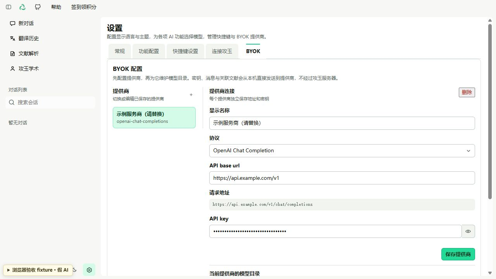
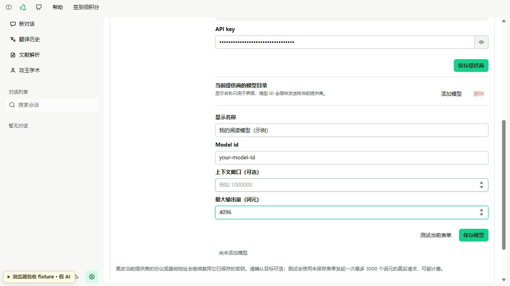
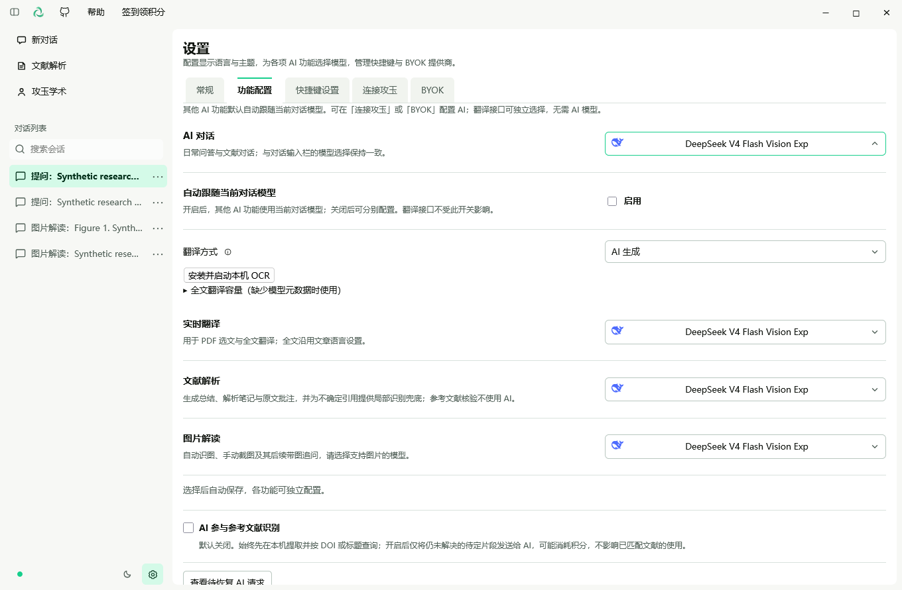
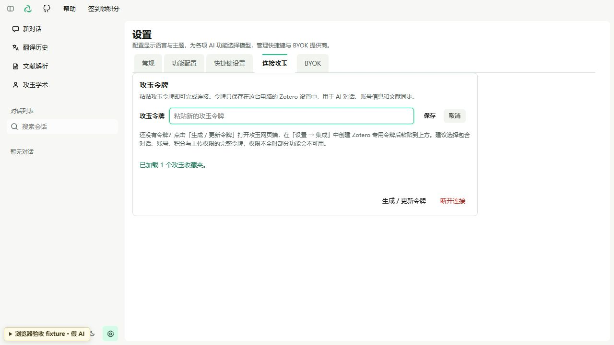
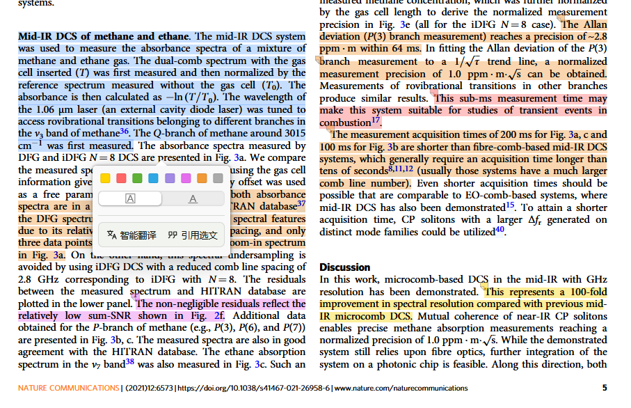
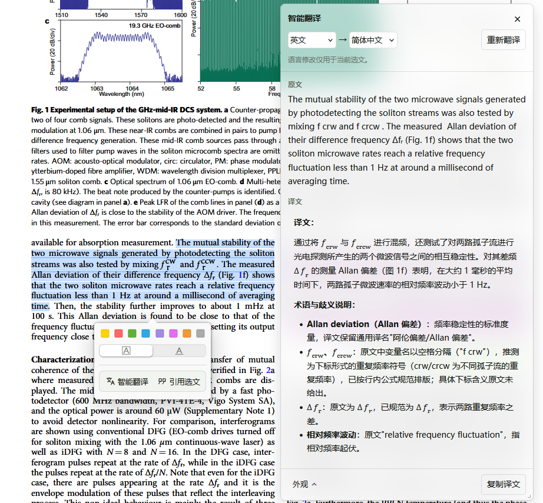
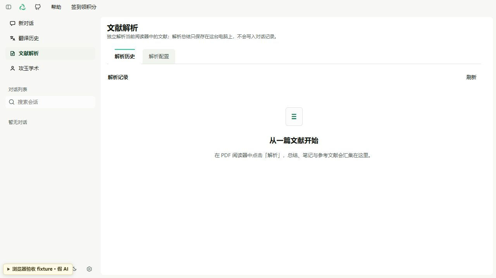
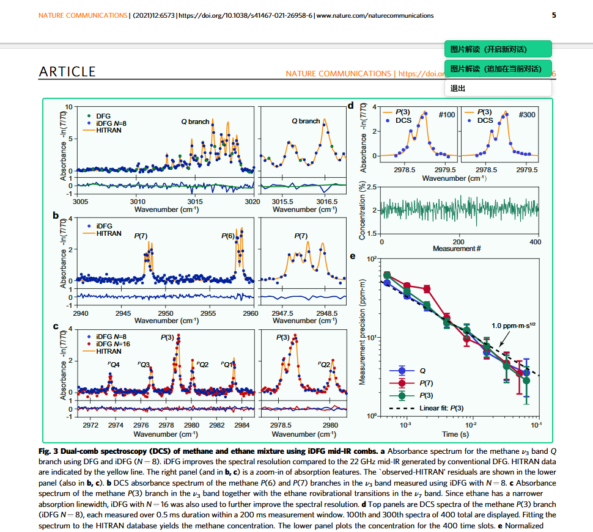

# Jadense in Zotero 使用指南

[返回 README](../README.md) · [Zotero 入门](zotero-guide.md) · [FAQ](faq.md)

## 目录

- [1. 安装并打开工作台](#install)
  - [1.1 下载与安装](#download-install)
  - [1.2 打开工作台](#open-workbench)
- [2. 配置 AI](#configure-ai)
  - [2.1 BYOK：保存提供商](#byok-provider)
  - [2.2 BYOK：添加模型](#byok-model)
  - [2.3 选择功能模型](#feature-models)
  - [2.4 连接攻玉](#connect)
- [3. 阅读操作](#reading)
  - [3.1 论文问答](#paper-chat)
  - [3.2 选文翻译](#selection-translation)
  - [3.3 全文翻译](#full-translation)
  - [3.4 文献解析](#paper-analysis)
  - [3.5 参考文献核验与导入](#references)
  - [3.6 图片解读](#figures)
  - [3.7 查看历史与恢复任务](#history)
- [4. 个性化与文献上传](#preferences)
  - [4.1 语言、主题与快捷键](#appearance)
  - [4.2 上传到攻玉](#upload)

本指南对应 0.4.4。下图使用 0.4.4 当前构建与合成数据拍摄：配置表单与解析历史来自真实 Manager 的浏览器预览，阅读器和功能配置来自 Windows / Zotero 10.0.2 隔离环境。示例 URL、模型 ID、输出量及模拟结果仅说明操作位置，不是推荐配置或真实模型效果；不含真实凭据。

## 1. 安装并打开工作台

### 1.1 下载与安装

从 [GitHub 最新 Release](https://github.com/jadense-ai/jadense-in-zotero/releases/latest) 下载 `.xpi`，不要下载 Source code 压缩包。在 Zotero 的「工具 → 插件」打开插件管理器，通过齿轮菜单「从文件安装插件」选择 XPI，按提示重启。

### 1.2 打开工作台

从「工具 → Jadense → 打开攻玉工作台」或阅读器的 Jadense 图标进入。首次显示快速开始时，可直接进入设置。旧版升级和插件身份差异见 [README 升级说明](../README.md#upgrade)。

## 2. 配置一种 AI 接入方式

### 2.1 BYOK：配置提供商

BYOK 是 Bring Your Own Key：使用自己在模型服务商处申请的 API 密钥，不需要攻玉账号。模型调用仍可能由服务商收费。

1. 打开工作台「设置 → BYOK」，添加提供商。
2. 按服务商的 API 文档选择协议，填写 Base URL 与 API Key。
3. 添加模型，填写服务商提供的**精确模型 ID**，配置输出上限并保存。显示名称不能替代模型 ID。
4. 使用连接测试检查配置。测试会请求模型服务，可能产生服务商费用。
5. 到「设置 → 功能配置」选择 AI 对话模型。默认开启「自动跟随当前对话模型」，翻译、解析和图片解读随当前对话模型变化；需要分别选模型时，先关闭此开关。图片解读必须选支持图片输入的模型。

| 字段 | 应填写的内容 | 常见误区 |
| --- | --- | --- |
| 协议 | OpenAI Chat Completions、OpenAI Responses 或 Anthropic Messages | 兼容 Chat Completions 不代表也支持 Responses |
| Base URL | 服务商提供的 API 基础地址，保留要求的版本前缀 | 不填网页聊天地址，也不重复加请求端点 |
| API Key | 该 API 服务的密钥 | 不填网页登录密码、攻玉插件令牌 |
| 模型 ID | 服务商账户有权调用的完整模型 ID | 不凭产品名称猜模型 ID |
| 输出上限 | 模型支持的最大输出范围内的值 | 输出上限不是上下文窗口长度 |

#### 第一步：保存提供商

在「提供商」旁点击加号，填写显示名称、协议、API base url 与 API key，点击「保存提供商」。图中的 example.com 是示例域名，不是可调用服务。

### 2.2 BYOK：添加并保存模型

向下滚动到「当前提供商的模型目录」，点击「添加模型」。填写服务商真实模型 ID；上下文窗口可选，最大输出量应遵守该模型限制。图中的 your-model-id 和 4096 仅为填写示例。点击「保存模型」；「测试当前表单」会发起可能计费的请求。

### 2.3 选择功能使用的模型

回到「功能配置」，设置 AI 对话模型。图中为了展示独立配置，已关闭「自动跟随当前对话模型」；新用户默认开启。使用 BYOK 时，请在下拉框选择你保存的模型，而非图中示例的攻玉模型。

插件会根据协议，在 Base URL 后追加 `chat/completions`、`responses` 或 `messages`。例如，测试用基础地址 `https://api.example.com/v1` 配合 Chat Completions 会请求 `https://api.example.com/v1/chat/completions`；这是地址结构示例，不能直接使用。第三方网关请以其兼容协议和基础地址为准。

插件直接向配置的提供商发送 BYOK 请求，不会在失败时自动改用其他提供商。连接测试成功后，仍需确认功能所选模型正确。

### 2.4 连接攻玉

1. 登录[攻玉学术](https://jadense.cn/)，在「设置 → 集成 → 连接 Jadense in Zotero」创建插件令牌。
2. 在插件「设置 → 连接攻玉」粘贴并保存令牌。
3. 在「设置 → 功能配置」选择账号可用的模型；默认自动跟随对话模型的规则与 BYOK 相同。
4. 到「攻玉学术 → 用户信息」查看账号、订阅和积分。签到通过网页完成，再刷新插件中的状态。

令牌来自攻玉网页端「设置 → 集成」，粘贴后点击「保存」。已有令牌时先点击「编辑」；上图展示的是编辑状态。

模型可用性、费用和积分以账号页面为准；赞助本项目不会自动充值积分或开通订阅。

## 3. 完成第一次阅读

打开一篇本机可访问、可选中文字的 PDF，先用短段落测试配置。

| 想做什么 | 操作 | 结果与注意事项 |
| --- | --- | --- |
| 问论文问题 | PDF 阅读操作「提问」，输入问题 | 关联论文上下文，在本机保留对话 |
| 翻译选文 | 选中文字后「智能翻译」或 `Ctrl+Alt+T`（macOS：`⌘+Alt+T`） | 阅读器浮窗显示译文，可调整语言方向 |
| 翻译全文 | 阅读操作「全文翻译」 | 侧栏连续阅读译文，定位模式可回到原文；不是原版式双语 PDF 导出 |
| 解析论文 | 阅读操作「解析」 | 查看总结、笔记及可定位的原生批注；结合原文核对 |
| 查参考文献 | 「文献解析 → 论文详情 → 参考文献」 | 核验后选择条目导入 Zotero；不自动下载 PDF |
| 解读图片 | 点击自动识别的图片，或 `Ctrl+Alt+S`（macOS：`⌘+Alt+S`）框选 | 选择新对话或追加到当前对话；需图片模型 |

阅读器宽度不足时，操作收在「•••」菜单中。图片自动识别需要 Zotero 10.0.1+ 的兼容阅读器；不能自动识图时可尝试手动框选，或在对话中上传、粘贴、拖入 PNG/JPEG。每条消息可新附一张图片。

### 3.1 论文问答

1. 打开 PDF，在阅读操作中选择「提问」；窗口较窄时先展开「•••」。
2. 确认对话关联了当前论文，再输入问题，例如「请解释作者的方法，并指出关键证据所在段落」。
3. 对回答继续追问，并回到原文核对。需要讨论一个段落时，选中文字并选择开启新对话或追加到当前对话。

### 3.2 选文翻译

选中文字后，在工具条中点击「智能翻译」。上方对话操作可将选文用于新对话或当前对话；阅读器布局随窗口尺寸变化。

浮窗上方选择源语言与目标语言，下方可复制译文；当前图中的内容是合成测试结果，仅示意位置。

### 3.3 全文翻译

1. 打开可提取文字的 PDF，在阅读操作中选择「全文翻译」。
2. 在阅读器侧栏连续阅读译文，通过目录切换章节；字号和行距可独立调整。
3. 使用「阅读模式」浏览，或切换「定位模式」点击段落回到原文。
4. 隐藏侧栏后任务继续；中断后到「翻译历史」手动继续，不必重新处理已完成部分。

在「设置 → 功能配置 → 翻译」选择 AI 或传统翻译（Bing/Google）。全文翻译先运行本机 OCR，再将正文发给所选翻译服务；首次需安装依赖与模型。可在同一区域点击「安装并启动本机 OCR」。不提供原版式双语 PDF 导出。[OCR 安装说明](local-ocr.md)。

「文献解析」按文献和附件汇总原文、全文翻译、选中翻译与解析成果；Reader 侧栏仅展示当前 PDF 的成果。已有原文可独立阅读，打开历史不会自动重新翻译。

### 3.4 文献解析

1. 在 PDF 阅读操作中点击「解析」。
2. 等待结果后，从「文献解析」打开对应论文详情。
3. 分别查看「解析总结」「解析笔记」与「参考文献」，通过可定位批注核对原文；无法定位的笔记仍可查看。

在阅读器点击「解析」后，可从左侧「文献解析」回看记录，点击论文标题进入详情。图示为首次使用的空状态；完成解析后，记录会显示在此处。

### 3.5 参考文献核验与导入

1. 完成解析后，进入「文献解析 → 论文详情 → 参考文献」。
2. 核对作者、标题、DOI 与验证状态，仅选择已验证的条目导入。
3. 选择可写的 Zotero 目标，查看每条导入结果。同库 DOI 用于去重；导入的是元数据与链接，不自动下载 PDF。

「AI 参与参考文献识别」默认关闭；开启后，仍未解决的片段可能交给解析模型并产生费用。无法确认的条目继续显示，不应当作已验证来源。

0.4.6 起，每条参考文献提供「编辑参考文献」和「删除参考文献」。编辑完整引用文本并保存后，点击「重新核验」更新匹配结果；手动编辑内容不会被后续 AI 批量识别覆盖。删除需要确认，只移除该解析结果中的引用记录，保留 Zotero 文献、PDF 和已导入条目。读取、核验或导入期间，这两个操作暂不可用。

### 3.6 图片解读

自动识别可用时点击图像，或使用截图快捷键框选 PDF 区域。选择支持图片的模型后，决定开启新对话还是追加到当前对话。

按截图快捷键，在 PDF 中框选区域后，选择「开启新对话」或「追加在当前对话」；不需要解读时退出框选。

### 3.7 查看历史与恢复任务

全文翻译隐藏侧栏后继续运行；中断后从「翻译历史」手动继续。解析历史在「文献解析」中查看。打开历史不会自动重新请求 AI。遇到待确认的攻玉请求，先使用「恢复结果」读取已有结果。

## 4. 调整偏好与上传文献

### 4.1 语言、主题与快捷键

「设置 → 常规」可修改界面语言、主题与字号；语言需重启 Zotero，主题立即生效。「设置 → 快捷键设置」可修改翻译和截图快捷键。

### 4.2 上传到攻玉

连接攻玉后，在 Zotero 选中文献，打开「攻玉学术 → 文献同步」，选择目标收藏夹与是否包含 PDF，再主动上传。该操作是 **Zotero → 攻玉单向上传**，元数据与 PDF 分别报告结果；不会自动同步插件对话、笔记和批注。

遇到问题先查 [FAQ](faq.md)，提交反馈前去除 API Key、插件令牌和私人论文内容。
