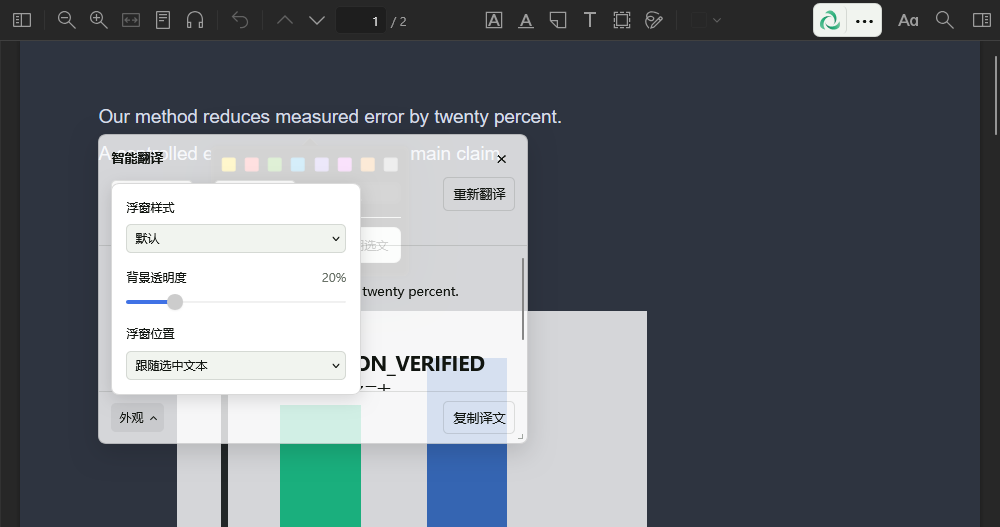
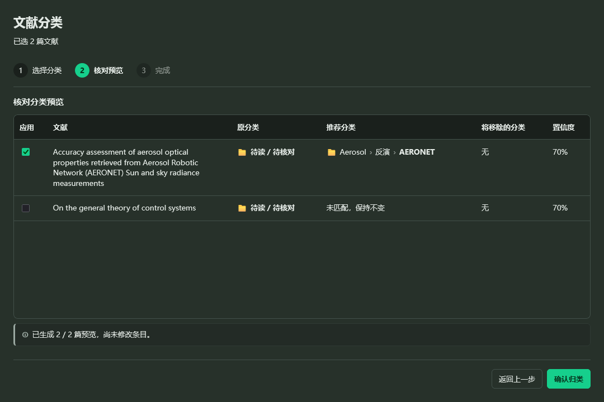
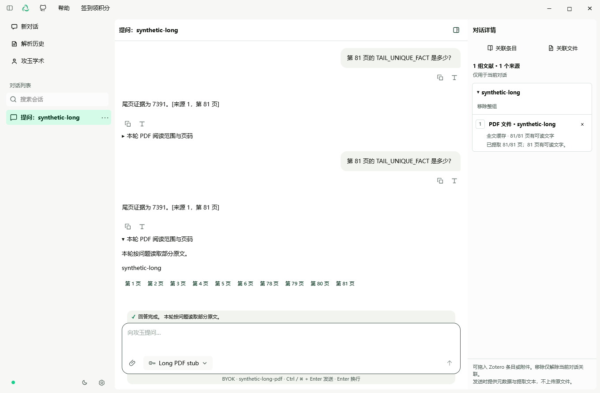
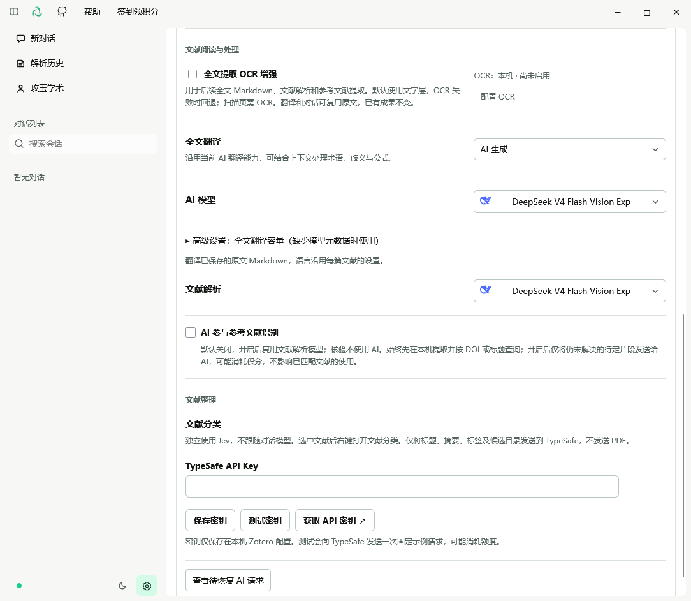
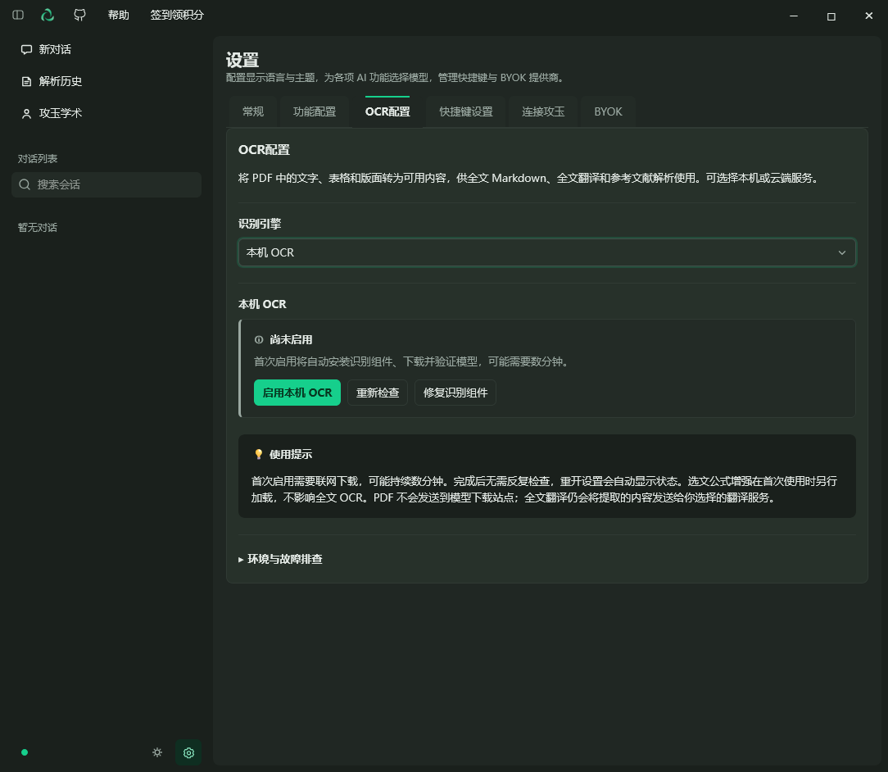
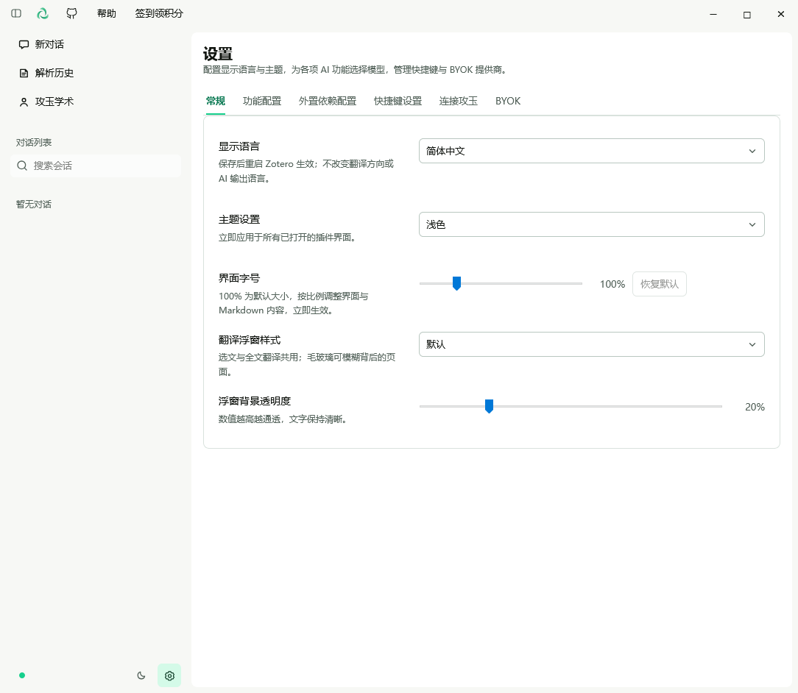

# Jadense in Zotero 使用指南

[返回 README](../README.md) · [Zotero 入门](zotero-guide.md) · [FAQ](faq.md)

- [0.6.0 对照翻译与引擎配置](#pdf-translation-060)

## 目录

- [1. 安装并打开工作台](#install)
  - [1.1 下载与安装](#download-install)
  - [1.2 打开工作台](#open-workbench)
- [2. 配置 AI](#configure-ai)
  - [2.1 BYOK：保存提供商](#byok-provider)
  - [2.2 BYOK：添加模型](#byok-model)
  - [2.3 选择功能模型](#feature-models)
  - [2.4 连接攻玉](#connect)
- [3. 阅读操作](#reading)
  - [3.1 论文问答](#paper-chat)
  - [3.2 选文翻译](#selection-translation)
  - [3.3 全文翻译](#full-translation)
  - [3.4 文献解析](#paper-analysis)
  - [3.5 参考文献核验与导入](#references)
  - [3.6 图片解读](#figures)
  - [3.7 查看历史与恢复任务](#history)
- [4. 个性化与文献上传](#preferences)
  - [4.1 语言、主题与快捷键](#appearance)
  - [4.2 上传到攻玉](#upload)

本指南对应 0.4.4。下图使用 0.4.4 当前构建与合成数据拍摄：配置表单与解析历史来自真实 Manager 的浏览器预览，阅读器和功能配置来自 Windows / Zotero 10.0.2 隔离环境。示例 URL、模型 ID、输出量及模拟结果仅说明操作位置，不是推荐配置或真实模型效果；不含真实凭据。

## 1. 安装并打开工作台

### 1.1 下载与安装

从 [GitHub 最新 Release](https://github.com/jadense-ai/jadense-in-zotero/releases/latest) 下载 `.xpi`，不要下载 Source code 压缩包。在 Zotero 的「工具 → 插件」打开插件管理器，通过齿轮菜单「从文件安装插件」选择 XPI，按提示重启。

### 1.2 打开工作台

从「工具 → Jadense → 打开攻玉工作台」或阅读器的 Jadense 图标进入。首次显示快速开始时，可直接进入设置。旧版升级和插件身份差异见 [README 升级说明](../README.md#upgrade)。

## 2. 配置一种 AI 接入方式

### 2.1 BYOK：配置提供商

BYOK 是 Bring Your Own Key：使用自己在模型服务商处申请的 API 密钥，不需要攻玉账号。模型调用仍可能由服务商收费。

1. 打开工作台「设置 → BYOK」，添加提供商。
2. 按服务商的 API 文档选择协议，填写 Base URL 与 API Key。
3. 添加模型，填写服务商提供的**精确模型 ID**，配置输出上限并保存。显示名称不能替代模型 ID。
4. 使用连接测试检查配置。测试会请求模型服务，可能产生服务商费用。
5. 到「设置 → 功能配置」选择 AI 对话模型。默认开启「自动跟随当前对话模型」，翻译、解析和图片解读随当前对话模型变化；需要分别选模型时，先关闭此开关。图片解读必须选支持图片输入的模型。

| 字段 | 应填写的内容 | 常见误区 |
| --- | --- | --- |
| 协议 | OpenAI Chat Completions、OpenAI Responses 或 Anthropic Messages | 兼容 Chat Completions 不代表也支持 Responses |
| Base URL | 服务商提供的 API 基础地址，保留要求的版本前缀 | 不填网页聊天地址，也不重复加请求端点 |
| API Key | 该 API 服务的密钥 | 不填网页登录密码、攻玉插件令牌 |
| 模型 ID | 服务商账户有权调用的完整模型 ID | 不凭产品名称猜模型 ID |
| 输出上限 | 模型支持的最大输出范围内的值 | 输出上限不是上下文窗口长度 |

#### 第一步：保存提供商

在「提供商」旁点击加号，填写显示名称、协议、API base url 与 API key，点击「保存提供商」。图中的 example.com 是示例域名，不是可调用服务。

### 2.2 BYOK：添加并保存模型

向下滚动到「当前提供商的模型目录」，点击「添加模型」。填写服务商真实模型 ID；上下文窗口可选，最大输出量应遵守该模型限制。图中的 your-model-id 和 4096 仅为填写示例。点击「保存模型」；「测试当前表单」会发起可能计费的请求。

### 2.3 选择功能使用的模型

回到「功能配置」，设置 AI 对话模型。图中为了展示独立配置，已关闭「自动跟随当前对话模型」；新用户默认开启。使用 BYOK 时，请在下拉框选择你保存的模型，而非图中示例的攻玉模型。

插件会根据协议，在 Base URL 后追加 `chat/completions`、`responses` 或 `messages`。例如，测试用基础地址 `https://api.example.com/v1` 配合 Chat Completions 会请求 `https://api.example.com/v1/chat/completions`；这是地址结构示例，不能直接使用。第三方网关请以其兼容协议和基础地址为准。

插件直接向配置的提供商发送 BYOK 请求，不会在失败时自动改用其他提供商。连接测试成功后，仍需确认功能所选模型正确。

### 2.4 连接攻玉

1. 登录[攻玉学术](https://jadense.cn/)，在「设置 → 集成 → 连接 Jadense in Zotero」创建插件令牌。
2. 在插件「设置 → 连接攻玉」粘贴并保存令牌。
3. 在「设置 → 功能配置」选择账号可用的模型；默认自动跟随对话模型的规则与 BYOK 相同。
4. 到「攻玉学术 → 用户信息」查看账号、订阅和积分。签到通过网页完成，再刷新插件中的状态。

令牌来自攻玉网页端「设置 → 集成」，粘贴后点击「保存」。已有令牌时先点击「编辑」；上图展示的是编辑状态。

模型可用性、费用和积分以账号页面为准；赞助本项目不会自动充值积分或开通订阅。

## 3. 完成第一次阅读

打开一篇本机可访问、可选中文字的 PDF，先用短段落测试配置。

| 想做什么 | 操作 | 结果与注意事项 |
| --- | --- | --- |
| 问论文问题 | PDF 阅读操作「提问」，输入问题 | 关联论文上下文，在本机保留对话 |
| 翻译选文 | 选中文字后「智能翻译」或 `Ctrl+Alt+T`（macOS：`⌘+Alt+T`） | 阅读器浮窗显示译文，可调整语言方向 |
| 翻译全文 | 阅读操作「全文翻译」 | 侧栏连续阅读译文，定位模式可回到原文；不是原版式双语 PDF 导出 |
| 解析论文 | 阅读操作「解析」 | 查看总结、笔记及可定位的原生批注；结合原文核对 |
| 查参考文献 | 「文献解析 → 论文详情 → 参考文献」 | 核验后选择条目导入 Zotero；不自动下载 PDF |
| 解读图片 | 点击自动识别的图片，或 `Ctrl+Alt+S`（macOS：`⌘+Alt+S`）框选 | 选择新对话或追加到当前对话；需图片模型 |

阅读器宽度不足时，操作收在「•••」菜单中。图片自动识别需要 Zotero 10.0.1+ 的兼容阅读器；不能自动识图时可尝试手动框选，或在对话中上传、粘贴、拖入 PNG/JPEG。每条消息可新附一张图片。

### 3.1 论文问答

1. 打开 PDF，在阅读操作中选择「提问」；窗口较窄时先展开「•••」。
2. 确认对话关联了当前论文，再输入问题，例如「请解释作者的方法，并指出关键证据所在段落」。
3. 对回答继续追问，并回到原文核对。需要讨论一个段落时，选中文字并选择开启新对话或追加到当前对话。

### 3.2 选文翻译

选中文字后，在工具条中点击「智能翻译」。上方对话操作可将选文用于新对话或当前对话；阅读器布局随窗口尺寸变化。

浮窗上方选择源语言与目标语言，下方可复制译文；当前图中的内容是合成测试结果，仅示意位置。

### 3.3 全文翻译

1. 打开可提取文字的 PDF，在阅读操作中选择「全文翻译」。
2. 在阅读器侧栏连续阅读译文，通过目录切换章节；字号和行距可独立调整。
3. 使用「阅读模式」浏览，或切换「定位模式」点击段落回到原文。
4. 隐藏侧栏后任务继续；中断后到「翻译历史」手动继续，不必重新处理已完成部分。

在「设置 → 功能配置 → 翻译」选择 AI 或传统翻译（Bing/Google）。0.5.0 默认读取文字层；扫描页需要 OCR 时，在「设置 → OCR配置」点击「启用本机 OCR / 继续准备」，等待依赖与模型就绪。提取后的正文会发给所选翻译服务。首次全文翻译会提示费用与稳定性，可取消并改用选文翻译。不提供原版式双语 PDF 导出。[详细 OCR 安装说明](local-ocr.md)包含设置操作及 Windows、Linux、macOS 手动步骤。

「文献解析」按文献和附件汇总原文、全文翻译、选中翻译与解析成果；Reader 侧栏仅展示当前 PDF 的成果。已有原文可独立阅读，打开历史不会自动重新翻译。

### 3.4 文献解析

1. 在 PDF 阅读操作中点击「解析」。
2. 等待结果后，从「文献解析」打开对应论文详情。
3. 分别查看「解析总结」「解析笔记」与「参考文献」，通过可定位批注核对原文；无法定位的笔记仍可查看。

在阅读器点击「解析」后，可从左侧「文献解析」回看记录，点击论文标题进入详情。图示为首次使用的空状态；完成解析后，记录会显示在此处。

### 3.5 参考文献核验与导入

1. 完成解析后，进入「文献解析 → 论文详情 → 参考文献」。
2. 核对作者、标题、DOI 与验证状态，核对后再选择候选导入。「已选首条」表示无精确匹配时采用首条有效结果，不保证匹配准确。
3. 选择可写的 Zotero 目标，查看每条导入结果。同库 DOI 用于去重；导入的是元数据与链接，不自动下载 PDF。

「AI 参与参考文献识别」默认关闭；开启后，仍未解决的片段可能交给解析模型并产生费用。无法确认的条目继续显示，不应当作已验证来源。

0.4.6 起，每条参考文献提供「编辑参考文献」和「删除参考文献」。编辑完整引用文本并保存后，点击「重新核验」更新匹配结果；手动编辑内容不会被后续 AI 批量识别覆盖。删除需要确认，只移除该解析结果中的引用记录，保留 Zotero 文献、PDF 和已导入条目。读取、核验或导入期间，这两个操作暂不可用。

### 3.6 图片解读

自动识别可用时点击图像，或使用截图快捷键框选 PDF 区域。选择支持图片的模型后，决定开启新对话还是追加到当前对话。

按截图快捷键，在 PDF 中框选区域后，选择「开启新对话」或「追加在当前对话」；不需要解读时退出框选。

### 3.7 查看历史与恢复任务

全文翻译隐藏侧栏后继续运行；中断后从「翻译历史」手动继续。解析历史在「文献解析」中查看。打开历史不会自动重新请求 AI。遇到待确认的攻玉请求，先使用「恢复结果」读取已有结果。

## 4. 调整偏好与上传文献

### 4.1 语言、主题与快捷键

「设置 → 常规」可修改界面语言、主题与字号；语言需重启 Zotero，主题立即生效。「设置 → 快捷键设置」可修改翻译和截图快捷键。

### 4.2 上传到攻玉

连接攻玉后，在 Zotero 选中文献，打开「攻玉学术 → 文献同步」，选择目标收藏夹与是否包含 PDF，再主动上传。该操作是 **Zotero → 攻玉单向上传**，元数据与 PDF 分别报告结果；不会自动同步插件对话、笔记和批注。

遇到问题先查 [FAQ](faq.md)，提交反馈前去除 API Key、插件令牌和私人论文内容。

## 0.4.8：选文与 OCR 配置 / Selection and OCR settings

以下功能随 0.4.8 正式版提供。选文浮窗的外观菜单可切换记住位置/跟随选文；「设置 → 功能配置 → 选中文本」可选择等待、自动翻译或引用到新侧栏对话。引用只填入草稿，不自动发送。

在「设置 → OCR」选择「OCR 模型下载源」。默认使用 Hugging Face（或环境地址）；连接超时时可选第三方 HF-Mirror，然后重新点击全文翻译，无需重装或重启。只从该来源下载公开模型，PDF 仍在本机识别；正在运行的任务不变。

These options are included in v0.4.8. Use the selection window appearance menu to change positioning, and Settings → Feature configuration → Selected text to choose selection actions. Quoting creates a draft without sending it. Under Settings → OCR, select the model download source and retry full translation; no reinstall or restart is needed. The optional third-party mirror downloads public models while PDF recognition stays local.

在「设置 → 功能配置 → 选中文本」设置选文后的操作；默认等待。勾选「OCR增强选中文本内容提取」后，引用或翻译前在本机识别选区文字与公式。默认关闭，直接使用改进后的 PDF 文字层。首次使用需要 OCR 依赖和模型；失败时提示并使用原选文，可在「设置 → OCR配置」检查安装状态与下载源。切换开关不会重新处理已有选文或历史。公式识别仍需人工核对。

Under Settings → Feature configuration → Selected text, choose the selection action (Wait by default) and optionally enable OCR-enhanced extraction. OCR runs locally before quoting or translating; first use needs dependencies and models. Failure shows a notice and uses the original selection. Check installation and download source under OCR configuration. Changing the setting does not reprocess existing selections or history. Verify recognized formulas against the PDF.

## 0.4.9：全文翻译恢复、OCR 状态与诊断 / Full-translation recovery, OCR status and diagnostics

本节对应正式版 0.4.9。全文翻译、OCR 配置和本机诊断的具体操作如下。

- 在「设置 → OCR配置」点击「启用本机 OCR」，失败后点击「继续准备」。打开设置自动读取状态；已有环境和模型尽量复用。全文 Markdown、全文翻译和参考文献任务需要先准备完成。详见[本机 OCR 指南](local-ocr.md)。
- 下载源可选 Hugging Face、HF-Mirror 或魔搭 ModelScope。切换来源不上传 PDF，也不改变翻译服务；重试会复用已完成下载的文件。
- 全文翻译中断后保留已完成内容，按提示手动继续；积分、账号或模型配置问题需先修复。不会自动重发失败请求。
- 在工作台帮助菜单中，5 秒内点击版本号 5 次，启用「错误诊断」。可筛选、复制、导出和清空本机记录；最多保留 7 天、500 条、2 MiB。导出前仍请核对内容，再决定是否主动分享。

This section describes the published v0.4.9 release.

- Open Settings → OCR configuration and choose Enable local OCR, or Continue setup after a failure. Readiness loads automatically and existing environments/models are reused where possible. Prepare OCR before full Markdown extraction, full translation or reference extraction.
- Choose Hugging Face, HF-Mirror or ModelScope as the model download source. Changing it neither uploads PDFs nor changes your translation provider; retries reuse completed files.
- Interrupted full translations retain completed content. Resolve account, points or model configuration problems, then resume manually; failed requests are not automatically resent.
- In the workbench Help menu, activate the version number five times within five seconds to enable Error diagnostics. Filter, copy, export or clear local records (up to 7 days, 500 records or 2 MiB). Review any export before choosing to share it.

## 0.4.10：OCR 安装进度与重装 / OCR setup and reinstallation

「设置 → OCR配置」显示准备阶段、下载量和等待时间。失败后先换下载源并继续；组件损坏时选择「修复识别组件」。需要重装时在「环境与故障排查 → 删除与重装」确认删除，默认保留模型与历史成果，然后点击「重新安装 OCR」。[完整指南](local-ocr.md)包含 Windows、Linux、macOS 手动安装和模型验证。

Settings → OCR configuration shows setup stages, download size and elapsed time. Retry with another model source after download failures, or use Repair recognition components for damaged dependencies. Under Environment and troubleshooting → Remove and reinstall, confirm dependency removal (models and saved results are retained by default), then choose Reinstall OCR. The [full guide (Chinese)](local-ocr.md) includes separate Windows, Linux and macOS manual steps and model verification.

## 0.5.0：文献分类、长文阅读与可选 OCR / Classification, long PDFs and optional OCR

本节适用于已发布的 0.5.0。前面的 0.4.x 全文任务准备步骤仍适用于对应旧版。

### 文献分类 / Paper classification

在 Zotero 文献列表选中条目，右键选择「文献分类…」，打开独立窗口。在工作台「设置 → 功能配置」保存 TypeSafe API Key 后返回，选择候选分类目录，点击「生成推荐预览」，核对结果后再应用；生成预览不会修改条目。可撤销本次归类。配置测试会发送示例请求，可能消耗额度；分类独立使用 Jev，仅发送标题、摘要、标签及候选目录，不发送 PDF。请求失败后停止后续请求，已完成的预览仍可核对。

Select papers in Zotero and choose Paper classification from the context menu. Save a TypeSafe API key in Settings → Feature configuration, return to the standalone window, choose candidate collections and generate recommendations. Review before applying; previews do not change items, and applied classification can be undone. Testing the key may use credits. Classification uses Jev independently of Chat and sends titles, abstracts, tags and candidate collections, not PDFs. A failed request stops remaining requests while keeping completed recommendations available.

### 文件与长 PDF / Files and long PDFs

在对话输入区添加 PDF、DOCX、HTML、Markdown 或常用文本文件，或关联 Zotero PDF。上传文件每个最大 20 MB、最多提取前 60,000 字符；DOCX 仅提取正文，不含图片、批注与页眉页脚，旧 DOC 需先转换。完整长 PDF 阅读请使用关联 Zotero PDF 的入口。可读正文缓存在本机；短文直接进入上下文，长文按模型容量分块概括并召回相关原文，可能产生多次模型请求及相应费用。查看阅读进度、缺页提示与回答页码来源，并对照原文核查。扫描缺页需用户主动准备 OCR；缓存或提取失败会提示，不代表全文已读完。

Attach PDF, DOCX, HTML, Markdown or common text files in the chat composer, or link Zotero PDFs. Uploaded files are limited to 20 MB and the first 60,000 extracted characters; DOCX includes body text only, excluding images, comments, headers and footers. Convert legacy DOC files first. Use linked Zotero PDFs for full long-document reading. Readable text is cached locally. Short documents fit directly into context; longer documents use chunked summaries and relevant source passages within model limits, potentially producing multiple billed requests. Check progress, missing-page warnings and page references against the original. Scanned pages require user-enabled OCR; extraction or cache warnings must not be interpreted as complete reading.

### 全文提取与恢复 / Extraction and recovery

原文提取工具栏可为本次提取选择「不使用 OCR / 使用 OCR」；OCR 需先配置就绪。首次全文翻译会提示积分消耗与稳定性，取消不会发起提取或翻译请求；确认后在当前 profile 记住选择。可优先选中需要精读的段落翻译。

Choose Without OCR or Use OCR in the source-extraction toolbar for that extraction; OCR must be configured and ready. The first full translation asks you to acknowledge cost and stability considerations. Canceling starts no extraction or translation request; acceptance is remembered in the current profile. Prefer selection translation for passages needing close reading.

参考文献列表分别显示「原文引用」和「检索结果」，独立年份行保留在所属引用中。优先使用精确匹配；没有精确匹配时选用首条有效候选并标记「已选首条」，这不代表已准确匹配。核对题名、作者与年份后再勾选导入；编辑原文会清除旧候选，需要重新核验。

References show Original citation and Search result separately, retaining standalone year lines within their citation. Exact matches take priority; otherwise the first valid candidate is labeled First result selected, which does not establish an exact match. Review title, authors and year before selecting and importing. Editing a citation clears the old candidate and requires verification again.

全文 Markdown、全文翻译和参考文献提取默认使用文字层。需要识别扫描页时在「设置 → OCR配置」启用全文 OCR 增强并准备依赖与模型；OCR 失败时尝试文字层，并保留无文字页提示。翻译和分析仍需对应 AI 或传统翻译服务。侧栏异常可重试；仍无法恢复时，从 Zotero 工具菜单或「帮助 → 错误诊断」导出本机诊断。

Full Markdown, full translation and reference extraction use the text layer by default. Enable full-document OCR in OCR configuration and prepare dependencies/models for scanned pages. OCR failures fall back to the text layer with warnings for unreadable pages. Translation and analysis still require their configured service. Retry a failed sidebar; if it remains unavailable, export local diagnostics from Zotero's Tools menu or Help → Error diagnostics.

### 文献分类预览 / Classification preview

图示来自 0.5.0 正式标签原包、Windows 11 / Zotero 10.0.3 的隔离 profile，文献与服务结果为合成数据。Screenshot from the tag-built 0.5.0 XPI on Windows 11 / Zotero 10.0.3 with synthetic data and mocked responses.

长 PDF 图示同样使用合成 81 页 PDF 和模拟模型，不代表真实模型推理效果。The long-PDF screenshot uses an 81-page synthetic PDF and a mocked model.

## 0.5.1 功能配置与云 OCR / Feature settings and cloud OCR

在工作台或 Zotero 原生设置打开「功能配置」，分别设置选文翻译和全文翻译的服务与模型；语言沿用每篇文献的设置。旧翻译设置自动作为迁移来源，不覆盖已保存的独立设置；如启用了跟随对话模型，先检查该选项。OCR 用途开关与引擎配置分开，点击用途旁的配置入口可跳到 OCR 配置并返回。现有译文不会自动更新，需要时重新翻译。

在「OCR配置」选择本机 OCR，或 MinerU、智谱 GLM-OCR、硅基流动、阿里百炼、OpenAI compatible。云服务填写 API Key、模型和 HTTPS 接口地址，确认文档上传及费用后「保存并使用」；「测试识别」发送内置示例图片，可能产生费用。更换地址需重新确认；不要把令牌放在 URL 中。凭证通过 Zotero 登录管理器保存，无法持久化时仅在当前会话使用，重启后需重新填写。

全文提取 OCR 增强默认关闭，普通任务读取文字层；扫描页需要可用 OCR。全文任务和选文 OCR 按各自用途开关使用所选引擎。云 OCR 会把相应 PDF 或页面图片发到所选第三方，受其隐私、限额和计费规则约束；本机 OCR 需另行准备 Python 依赖及模型。云识别失败后先检查密钥、模型、额度和网络，再主动重试；文字层回退不保证扫描页可读。已有成果和缓存不会因为切换引擎自动重算。

Open **Feature settings** in either the workbench or Zotero preferences to configure selection and full-document translation independently. Legacy settings migrate without overwriting saved independent preferences; check the follow-chat-model option if enabled. OCR usage switches link to the separate engine settings.

In **OCR settings**, choose local OCR or one of the cloud services above. Set the API key, model and HTTPS endpoint, confirm document upload and billing, then **Save and use**. **Test OCR** sends a built-in sample image and may incur charges. Changing endpoint requires confirmation again. Keys use Zotero's login manager; if persistence is unavailable, re-enter the session-only key after restart.

Text-layer extraction remains the default. Enable OCR only for the desired use; cloud OCR uploads the relevant PDF/page images to the selected provider. Review its privacy, quotas and billing. On failure, check credentials, model, quota and network before retrying. Text-layer fallback cannot make scanned pages readable. Existing results are not regenerated when changing engines. Live providers and recognition accuracy have not been validated in this release.

设置示意（Windows / Zotero 10.0.3，合成数据）：

## 0.6.0 对照翻译与引擎配置

1. 在 **设置 → 功能配置 → 全文翻译** 选择服务、模型、目标语言及精简/完整范围。精简默认保留出版信息和参考文献，完整翻译所有可译文字；只影响新任务，阅读器可单次覆盖。
2. 从该处的外置依赖链接进入 **外置依赖配置**，准备 PDF 翻译引擎。参见[自动安装、手动安装与库内备用源](pdf-engine.md)。OCR 与版面引擎分别准备，普通文字层提取不需要排版引擎。
3. 打开 PDF，在阅读操作中选择 **对照翻译**。译文逐步出现，可与原文并排阅读、切换整页译文、同步滚动或进入多屏模式。
4. 使用 **保存译文 / 保存对照** 导出 PDF，原附件不被覆盖。部分失败时可阅读和导出已有结果，再点击 **补译未完成部分**；补译会产生新的翻译请求，可能继续计费。
5. 扫描页保持原文；复杂公式、表格与版面应人工核对。旧历史不会自动重译；旧版未完成任务可能以新分片策略重启，界面会提示。

### English

Configure the translation service, model, target language and concise/full scope under **Settings → Feature settings → Full translation**. Follow the dependency link to prepare the [PDF engine](pdf-engine.en.md), then open **Parallel translation** from PDF reading actions. Read progressively completed output side by side, full-width or on another screen; toggle synchronized scrolling and save translated-only or bilingual PDFs. Partial results remain available, and **Translate remaining passages** reuses completed segments but may incur further translation charges. Scanned pages remain original. Review formulas, tables and layout against the source. Existing history is not automatically translated again; unfinished legacy tasks may restart using the new batching strategy with a visible notice.

### 0.6.0 常规设置

界面字号使用 80%–200% 滑块，拖动即时生效，可恢复 100%。下图为 Windows / Zotero 10.0.3 的 0.6.0 原生隔离验收，使用合成资料与服务。

## 0.6.1 设置界面调整

功能配置页移除“查看待恢复 AI 请求”按钮及其专用面板，无需替代配置。任务内部的错误恢复、部分译文和补译入口不变。升级保留已有设置和历史，已安装的版面解析引擎无需重装；离线安装继续使用 [v0.6.0 引擎 ZIP](https://github.com/jadense-ai/jadense-in-zotero/releases/tag/v0.6.0)。
